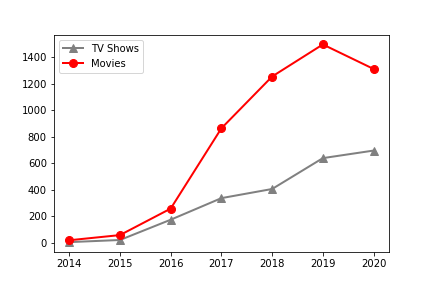

# Netflix Catolog Ratings

## Objective

We wanted to find what is the most common form of entertainment between movies and TV shows, as well as the most highly rated.

## What We Did
We created a search fucntion that would make things easier and translated the results into a graph. The results would create a line graph that would show the most popular genres over a period of time. It would show that overtime Movies have taken the lead in popularity, but seems to have gone down in favor, while TV shows have slowly but steadily increased in popularity.  

## Example

